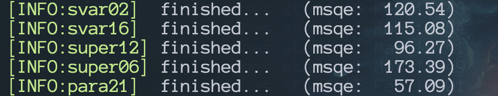
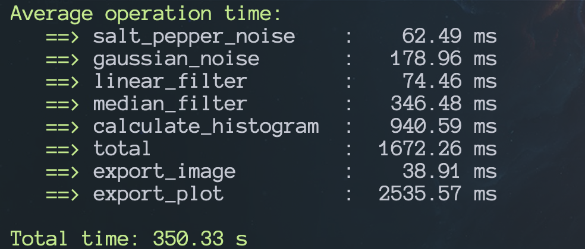

# CMSC 630 Project 1

## Image Processing and Filtering

### Overview

This program is designed to take a batch of images as input, and run given set of operations on them (Grey Scaling Salt and Pepper Noise, Gaussian Noise, Linear Filtering, Median Filtering, Histogram Calculations, Histogram Equalization, Image Quantization, and Mean Squared Error). All of these operations output a new image for each image in the batch. A TOML file in the root directory of the source code is used to configure the operations such as the strength of noise and the weights for filters. All important operations are implemented from scratch except for array operations that use the third-party mathematics library `numpy` and histogram plotting which uses the third-party `matplotlib` plotting library.

### Usage
```sh
Usage: main.py [OPTIONS]

Options:
  -c, --config PATH  [default: config.toml]
  --help             Show this message and exit.
```
### Execution

```sh
git clone https://github.com/jonaylor89/CMSC_630_Project_1.git
cd CMSC_630_Project_1
pip3 install --user pipenv
pipenv install
pipenv run python main.py
```
Or
```
docker run -it -v $HOME/Repos/CMSC630_Project_1/datasets:/app/datasets jonaylor/cmsc_project_1
```
*(this should pull the image already on dockerhub so the image won't be built locally)*

---

## Implementation

The programming language of choice for this project was python. The high level reason for making the decision to write everything in python was that it gives the ability to rapidly develop and integrate each operation as well as for python's `numpy` library which allows for idiomatic and fast array operations. Python's fairly obvious downside is its speed. To mitigate the problem of speed for the image operations, `numba` , a third-party python library used for mathematics, is being used. `numba` has a python function decorator for just-in-time compiling functions to machine code before executing. Using this decorator on functions that use heavy math and looping (i.e. filters and noise) provides major speed increases with speeds similar to using a lower level compiled language like C/C++ or Rust. Compilation time effects the first image in the batch, but every image thereafter uses the precompiled machine code. Image batches, rather than being operated on synchronously, are thrown into a process pool where a preconfigured number of worker processes pulls images off a queue and runs them through the operation pipelines. For plotting histograms, python's `matplotlib`, the fairly standard and robust plotting library, outputs plots to a file with the rest of the exported output images. An important note about plotting, MacOS and Windows require any GUI operation to be run in the main thread. `matplotlib` uses `Tkinter`, a GUI library, to generate plots, therefore plotting must be saved until the end and done synchronously on MacOS and Windows. Running the docker container will mitigate that by running the program inside a Linux VM behind the scenes on MacOS and Windows machines. The longest operation by far is exporting histograms due to the heavy overhead of `matplotlib`.

**Full Third-Party Dependency List**
```toml
# Pipefile
[packages]
pillow = "*"     # reading and writing images
numpy = "*"      # fast array operations
matplotlib = "*" # plotting
click = "*"      # command line interface utility
numba = "*"      # just-in-time compiler for operations
toml = "*"       # reading configuration file
tqdm = "*"       # progress bar
```
*These can be found in the Pipfile at the root of the source code*

---

## Functions
```python
    calculate_histogram(img_array: np.array) -> (np.array, np.array, np.array)
```

`calculate_histogram` generates the histogram for an image, the equalized histogram, and a new quantized image based on the equalized histogram.

```python
    mean_square_error(original_img: np.array, quantized_img: np.array) -> int
```

`mean_square_error` takes two images represented as `numpy` arrays and finds the mean squared error of all of their pixel values.  

```python
    select_channel(img_array: np.array, color: str = "red") -> np.array
```

`select_channel` isolates a color channel from a RGB image represented as a `numpy` array.

```python
    salt_pepper_noise(img_array: np.array, strength: int) -> np.array
```

`salt_pepper_noise` randomly jumps through a copy of an image and converts a certain percentage of pixels white or black. The percentage is given in the `strength` parameter and the percentage of white to black pixels is 50%.


```python
    gaussian_noise(img_array: np.array, sigma: int) -> np.array
```

`gaussian_noise` creates a `numpy` array with the same dimensions as the image and generates gaussian normal noise based off the `sigma` parameter. That noise is added to a copy of the original image to achieve gaussian noise.

```python
    linear_filter(img_array: np.array, mask_size: int, weights: List[List[int]]) -> np.array
```

`linear_filter` uses a kernel or matrix of weights, given as a two dimensional List, and applies that kernel to a copy of an image. Applying the filter loops through every pixel in the image and multiples the values of the neighboring pixels by the weights in the kernel. The larger the kernel, the larger the neighborhood of pixels that affect the pixel being operated on at any given moment.

```python
    median_filter(img_array: np.array, mask_size: int, weights: List[List[int]]) -> np.array
```

`median_filter` also uses a kernel or matrix of weights, given as a two dimensional List, and applies that kernel to a copy of an image. The median filter has the added effect of taking the median pixel value of a given neighborhood, of which the size of that neighborhood is specified by the size of the kernel, and assigning that value to the pixel in question at that moment.

```python
    apply_operations(img_file: Path)
```

`apply_operations` is the function used as the pipeline for all operations. This function takes an image and runs it through all the operations as well as timing how long each operation takes. This pipeline is what is being put in each process in the process pool.

```python
    parallel_operations(files: List[Path])
```

`parallel_operations` is simply the runner in charge of creating the process pool and running through all images in a queue and aggregating the time data they return back to get an average.

---

## Results

The output of this program can be seen in two places.  The first is in the output directory specified in the `toml` configuration file. In the output directory there are the gray scale images from each operation with the file name `{operation}_{original image}.BMP` (e.g. `median_svar53.BMP`) as well as the histogram plots generated for each image. Mean squared error and time results print to stdout and can be either piped to a file or viewed while the program is running. MSQE outputs for each image and time data prints last showing the average time per operation per batch as well as the total time for the whole batch.



MSQE output



Time output
