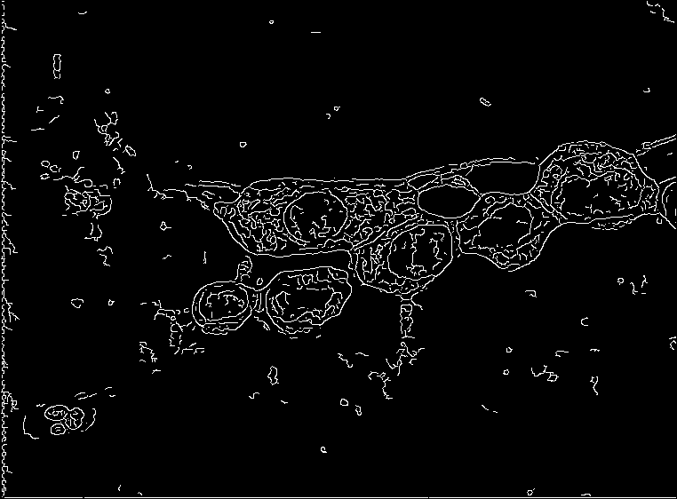
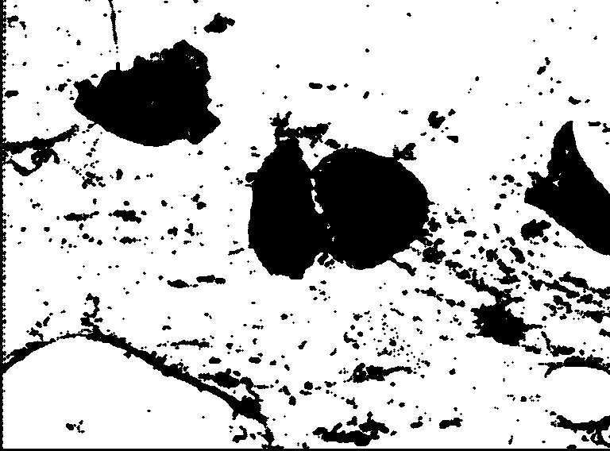
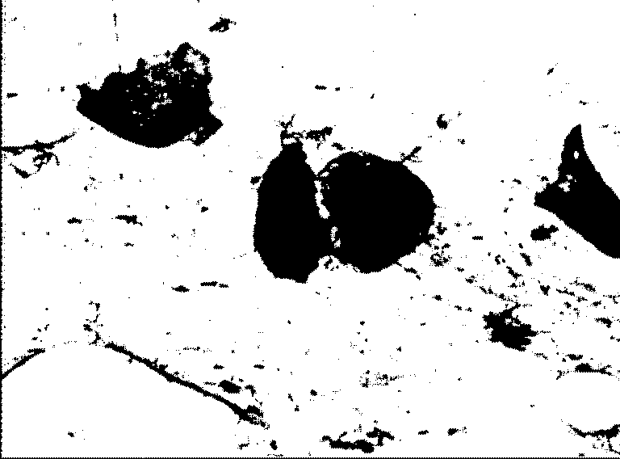
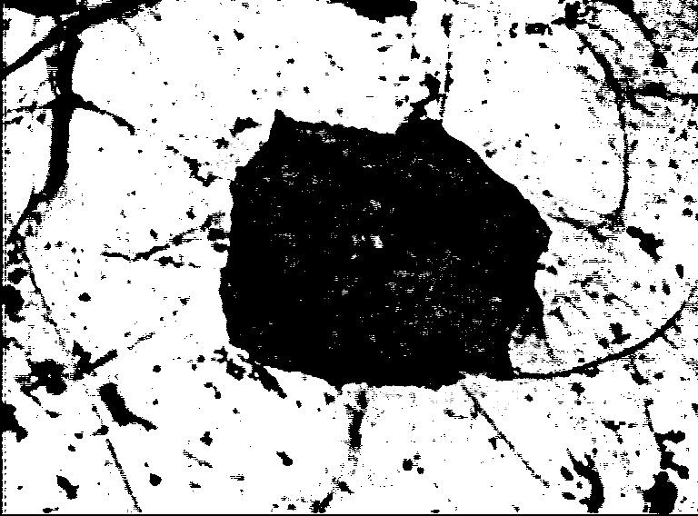
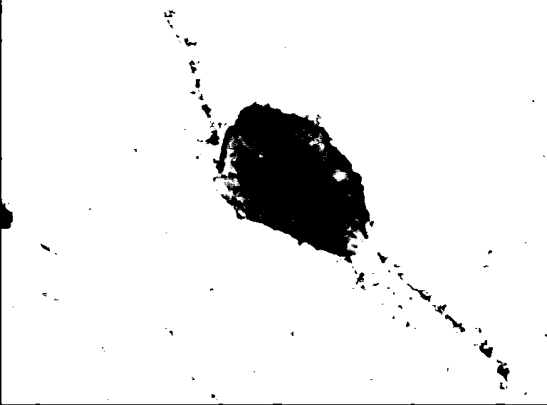

# CMSC 630 Project 2

### Image Segmentation and Clustering

## Overview

This program is designed to take a batch of images as input, and run given set of operations on them (Edge Detection, Histogram Clustering, Histogram Thresholding, Dilation, and Erosion). All of these operations output a new image for each image in the batch. A TOML file in the root directory of the source code is used to configure the operations such as the strength of noise and the weights for filters. All important operations are implemented from scratch except for array operations that use the third-party mathematics library `numpy`. 

### Usage

    Usage: main.py [OPTIONS]
    
    Options:
      -c, --config PATH  [default: config.toml]
      --help             Show this message and exit.

### Execution

    git clone https://github.com/jonaylor89/image-segmentation.git
    cd image-segmentation
    pip3 install --user pipenv
    pipenv install
    pipenv run python main.py

Or

    docker run -it -v $HOME/Repos/CMSC_630_Project_2/datasets:/app/datasets jonaylor/cmsc_project_2

*(this should pull the image already on dockerhub so the image won't be built locally)*

## Implementation

The programming language of choice for this project was python. The high level reason for making the decision to write everything in python was that it gives the ability to rapidly develop and integrate each operation as well as for python's `numpy` library which allows for idiomatic and fast array operations. Python's fairly obvious downside is its speed. To mitigate the problem of speed for the image operations, `numba` , a third-party python library used for mathematics, is being used. `numba` has a python function decorator for just-in-time compiling functions to machine code before executing. Using this decorator on functions that use heavy math and looping (i.g. convolving) provides major speed increases with speeds similar to using a lower level compiled language like C/C++ or Rust. Compilation time effects the first image in the batch, but every image thereafter uses the precompiled machine code. Image batches, rather than being operated on synchronously, are thrown into a process pool where a preconfigured number of worker processes pulls images off a queue and runs them through the operation pipelines. 

**Full Third-Party Dependency List**

    # Pipefile
    [packages]
    pillow = "**"     # reading and writing images
    numpy = "**"      # fast array operations
    *click = "**"      # command line interface utility
    numba = "**"      # just-in-time compiler for operations
    toml = "**"       # reading configuration file
    tqdm = "*"       # progress bar

*These can be found in the Pipfile at the root of the source code*

---

## Results

The output of this program can be seen in two places. The first is in the output directory specified in the `toml` configuration file. In the output directory there are the gray scale images from each operation with the file name `{operation}_{original image}.BMP` (e.g. `edges_svar53.BMP`).

    canny_edge_detection(img_array: np.array) -> np.array

Original

After Edge Detection

    dilate(img_array: np.array, win: int = 1) -> np.array

original

Segmented and Dilated

    erode(img_array: np.array, win: int = 1) -> np.array

original

Segmented and Eroded

    histogram_thresholding(img_array: np.array) -> np.array

original

segmented

    histogram_clustering(img_array: np.array) -> np.array

---

original

segmented
